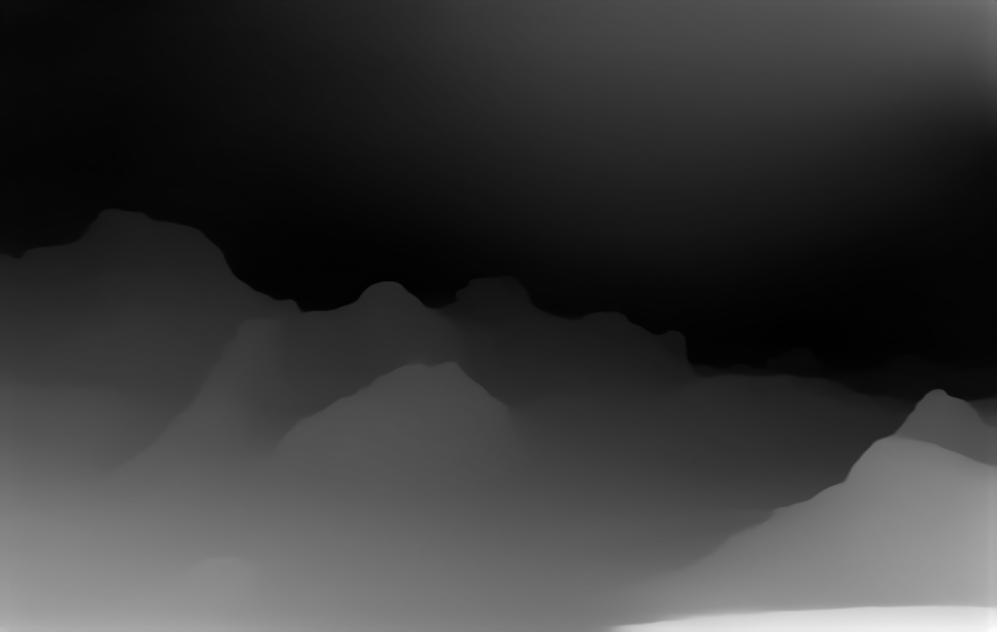

# Depth map

## Installation

```bash
pip install -r requirements.txt
```

## Usage

```bash
python depth_map.py --input 'path/to/input/image' --output 'path/to/output/image'
```

Example

```bash
python depth_map.py --input demo/landscape.png --output demo/landscape_depth.png
```




## Create a 3D photo on Facebook


[How do I create a 3D photo on Facebook?](www.facebook.com/help/414295416095269/?helpref=uf_share)
